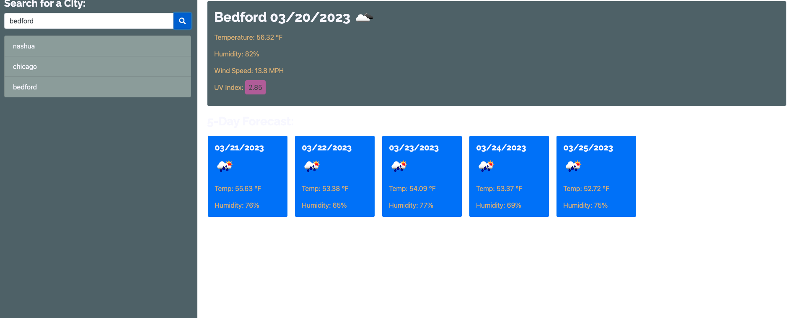

# Weather-Dashboard

[MIT license](https://img.shields.io/badge/License-MIT-blue.svg)

## Description
Third-party APIs allow developers to access their data and functionality by making requests with specific parameters to a URL. Developers are often tasked with retrieving data from another application's API and using it in the context of their own. Your challenge is to build a weather dashboard that will run in the browser and feature dynamically updated HTML and CSS.




```
Deployed: https://ezmaa.github.io/Weather-Dashboard/
```
## Table of Contents
* [Description](#description)
* [Installation](#installation)
* [Features](#features)
* [License](#license)
* [Questions](#questions)
## Installation 

- Download or clone repository
- Open the main page (index.html) on your browser to view
- Use a text editor to view all coding, Visual Studio Coding is recommended.
## Features

USER STORY 

```
- AS A traveler
- I WANT to see the weather outlook for multiple cities
- SO THAT I can plan a trip accordingly
```
ACCEPTANCE CRITERIA

```
- GIVEN a weather dashboard with form inputs
- WHEN I search for a city
- THEN I am presented with current and future conditions for that city and that city is added to the search history
- WHEN I view current weather conditions for that city
- THEN I am presented with the city name, the date, an icon representation of weather conditions, the - temperature, the humidity, and the the wind speed
- WHEN I view future weather conditions for that city
- THEN I am presented with a 5-day forecast that displays the date, an icon representation of weather conditions, the temperature, the wind speed, and the humidity
- WHEN I click on a city in the search history
- THEN I am again presented with current and future conditions for that city
```


## License 
This project is licensed under the MIT license.
## Licenses
    This project is covered under the MIT license. To learn more about what this means, click the license button at the top.
## Questions:
* Email: ezinmark@gmail.com
* Github: https://github.com/Ezmaa
* LinkedIn: [[Ezinma-Nwankwo](linkedin.com/in/ezinma-nwankwo-3b7905234)]